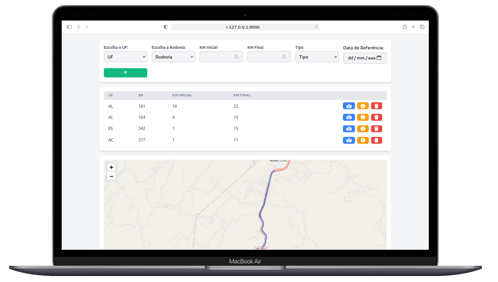
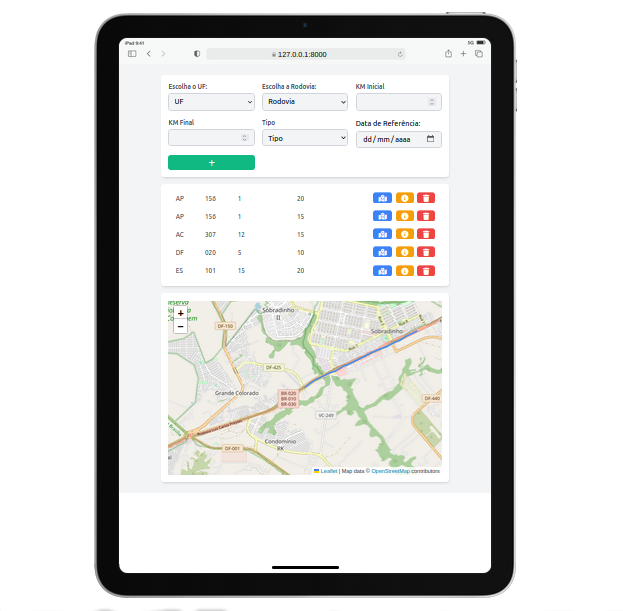
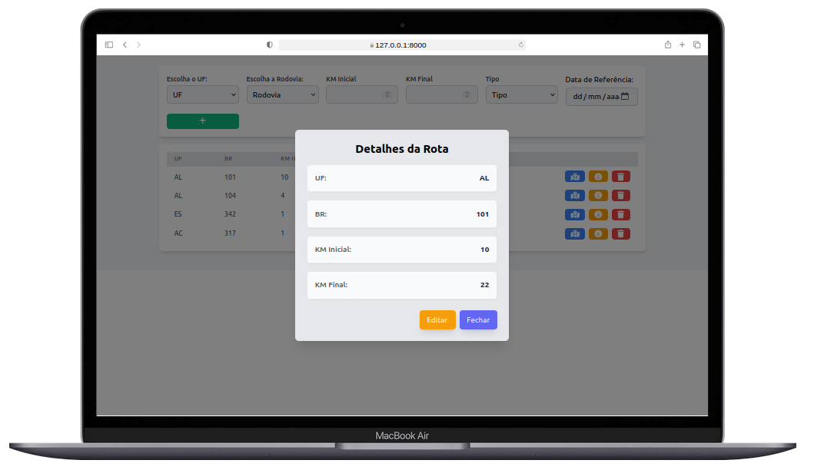

# Sistema de Gestão de Trechos Rodoviários

Este projeto é um sistema desenvolvido para o cadastro e gerenciamento de trechos de rodovias. O sistema permite aos usuários cadastrar, visualizar, editar e excluir trechos, além de exibir um mapa com a visualização espacial dos trechos cadastrados utilizando a biblioteca Leaflet.



## Funcionalidades

- **Cadastro de Trechos**: Permite o cadastro de novos trechos com informações como Unidade da Federação (UF), Rodovia, Tipo de Trecho, Quilometragem Inicial e Final, e Data de Referência.
- **Listagem de Trechos**: Exibe uma tabela paginada com todos os trechos cadastrados, permitindo a edição ou exclusão de um trecho específico.
- **Visualização de Mapas**: Exibe um mapa com a visualização dos trechos cadastrados, utilizando dados de geometria armazenados no banco de dados.
- **Edição e Exclusão**: Possibilita a edição e exclusão dos trechos cadastrados diretamente na listagem.

## Tecnologias Utilizadas

- **Backend**: Laravel 10.x
- **Frontend**: Vue.js com Composition API, Inertia.js
- **Banco de Dados**: MySQL
- **Biblioteca de Mapas**: Leaflet



## Instruções de Instalação

Siga os passos abaixo para clonar e rodar o projeto em sua máquina local:

1. **Clone o Repositório:**

   ```bash
   git clone https://github.com/SeuUsuario/gestao-trechos-rodoviarios.git
   cd gestao-trechos-rodoviarios
   ```

2. **Configure o Banco de Dados:**

  - Crie um banco de dados MySQL.
  - Renomeie o arquivo `.env.example` para `.env`.
  - Informe os parâmetros do banco de dados no arquivo `.env`:

    ```
    DB_CONNECTION=mysql
    DB_HOST=127.0.0.1
    DB_PORT=3306
    DB_DATABASE=nome_do_banco
    DB_USERNAME=nome_do_usuario
    DB_PASSWORD=senha
    ```

3. **Instale as Dependências do Composer:**

   ```bash
   composer install
   ```

4. **Gere a APP_KEY:**

   ```bash
   php artisan key:generate
   ```

5. **Instale as Dependências do NPM:**

   ```bash
   npm install
   ```

6. **Execute as Migrações:**

   ```bash
   php artisan migrate
   ```

7. **Importe os Dados Iniciais:**

  - Abra o banco de dados e importe os arquivos de UF para a tabela `ufs` e o arquivo de Rodovia para a tabela `rodovias`.
  - Você pode fazer o download dos arquivos necessários neste [link](https://drive.google.com/drive/folders/1wmtK7Y6xoLY0CPD0HmxI2ZNLP-Y_RUZX?usp=sharing).

8. **Inicie o Servidor Laravel:**

   ```bash
   php artisan serve
   ```

9. **Inicie o Servidor do Vue.js:**

   ```bash
   npm run dev
   ```

10. **Acesse o Sistema:**

  - Abra o navegador e acesse o link fornecido pelo servidor Laravel.



## Considerações Finais

Certifique-se de seguir as melhores práticas de desenvolvimento ao trabalhar com este projeto. Realize testes completos para garantir a funcionalidade e estabilidade do sistema.
